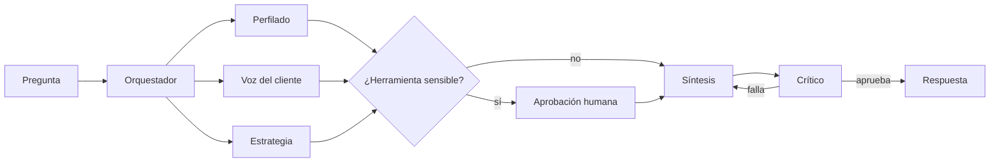

# 05 · Sistema multiagente



## Herramientas (function calling)

| agente | herramienta | firma | sensible | descripción |
|---|---|---|---|---|
| perfilado | describir_tablas | () -> 'str' |  | Lista las tablas disponibles para consultar_sql, con sus columnas. |
| perfilado | consultar_sql | (query: 'str') -> 'str' |  | Ejecuta una consulta SQL de SOLO LECTURA (DuckDB) sobre las tablas del Cluster 3. |
| perfilado | kpis_cluster | () -> 'str' |  | KPIs del Cluster 3: clientes, churn, intención, ARPU, renta en riesgo. |
| perfilado | resumen_modelo | () -> 'str' |  | Ficha del modelo predictivo de ML: estado, enfoque, validación, métricas de intención y churn, |
| perfilado | metricas_modelo | (modelo: 'str' = 'intencion') -> 'str' |  | Métricas del modelo 'intencion' o 'churn': AUC, PR-AUC, LIFT, matriz de confusión y top variables. |
| perfilado | importancia_variables | (modelo: 'str' = 'intencion', top: 'int' = 10) -> 'str' |  | Variables más importantes (SHAP medio, estabilidad entre folds y dirección) del modelo 'intencion' o 'churn'. |
| perfilado | riesgo_segmento | (condicion: 'str') -> 'str' |  | Resume el riesgo de un segmento definido por una condición SQL sobre la tabla clientes. |
| perfilado | explicar_cliente | (cliente_id: 'int', modelo: 'str' = 'churn') -> 'str' |  | Probabilidad de un cliente y las 5 variables que más empujan su riesgo (SHAP). |
| voz_cliente | resumen_llamadas | (cluster: 'int' = 3) -> 'str' |  | Motivos, urgencia, sentimiento y resultado de las llamadas de un cluster (por defecto el 3). |
| voz_cliente | buscar_llamadas | (texto: 'str', k: 'int' = 3, motivo: 'str / None' = None) -> 'str' |  | Busca las llamadas más parecidas a un texto (búsqueda semántica liviana). Devuelve id, motivo y evidencia. |
| voz_cliente | consultar_sql | (query: 'str') -> 'str' |  | Ejecuta una consulta SQL de SOLO LECTURA (DuckDB) sobre las tablas del Cluster 3. |
| estrategia | hallazgos_negocio | () -> 'str' |  | Insights de negocio del Cluster 3: qué se identificó y qué se puede mejorar. Combina KPIs, segmentos de |
| estrategia | listar_accionables | (tipo: 'str / None' = None) -> 'str' |  | Accionables priorizados con evidencia, métrica e impacto anual (COP) por escenario. tipo: Proactivo / Reactivo. |
| estrategia | calcular_impacto | (n_clientes: 'int', prob_irse: 'float', tasa_exito: 'float' = 0.3, arpu_cop: 'float / None' = None, meses: 'int' = 12, costo_contacto_cop: 'float' = 15000) -> 'str' |  | Impacto económico de retener: n × prob_irse × tasa_exito × ARPU × meses − n × costo de contacto (COP). |
| estrategia | kpis_cluster | () -> 'str' |  | KPIs del Cluster 3: clientes, churn, intención, ARPU, renta en riesgo. |
| estrategia | generar_lista_contacto | (decil_max: 'int' = 1, limite: 'int' = 500) -> 'str' | sí (HITL) | [SENSIBLE · requiere aprobación humana] Exporta la lista de clientes de los deciles de mayor riesgo de churn. |

## Human-in-the-loop

- `generar_lista_contacto` exporta datos de clientes: el grafo se detiene con `interrupt()` hasta que una persona apruebe.
- Llamadas con `confianza` < 0,6 en el NLP se envían a revisión manual.
- Los accionables se aprueban antes de salir a negocio.

## Criterios de éxito

- 100 % de las cifras de cada respuesta respaldadas por una herramienta (control automático del crítico).
- Ruta correcta del orquestador en el set de evaluación.
- Juez LLM (G-Eval) ≥ 4/5 en fidelidad y pertinencia cuando hay LLM disponible.

## Evaluación (set de preguntas doradas)

| pregunta | modo | ruta | ruta_ok | cifras_respaldadas | contenido_ok | hitl_ok | latencia_s | juez_fidelidad | juez_pertinencia | juez_utilidad | juez_claridad | juez_comentario |
|---|---|---|---|---|---|---|---|---|---|---|---|---|
| Hola, ¿quién eres y en qué me puedes ayudar? | llm | conversacion | True | True | True | True | 8.89 | 5 | 5 | 4 | 4 | No se citan cifras específicas, por lo que no aplica verificación de evidencia (fidelidad correcta por ausencia de datos sin respaldo). Responde exactamente lo preguntado (quién es y en qué ayuda), describiendo claramente los agentes disponibles. Es útil porque orienta al usuario con ejemplos concretos de próximas preguntas, aunque no ofrece una acción o conclusión de negocio inmediata al ser una respuesta introductoria. La claridad es buena, con estructura ordenada y uso de emojis/negritas que facilitan la lectura, aunque podría ser un poco más concisa. |
| ¿Ya tienen el modelo de machine learning? ¿Cómo funciona? | llm | perfilado | True | True | True | True | 18.6 | 5 | 5 | 5 | 3 | Todas las cifras (AUC 0,974; PR-AUC 0,588; lift 9,23x; recall 92,3%; 96/104 positivos; tasa base 0,52%) coinciden exactamente con los datos de [resumen_modelo], sin invención de datos. La respuesta cubre tanto la existencia del modelo como su funcionamiento, metodología, desempeño, limitaciones y una recomendación de negocio concreta (priorizar el decil de mayor riesgo antes de producción), lo que aporta valor accionable. Sin embargo, la respuesta es larga y usa bastante jerga técnica (LightGBM, SHAP, scale_pos_weight, calibración isotónica/sigmoide, PR-AUC) que excede lo necesario para una pregunta general de 'cómo funciona', reduciendo la claridad para un lector no técnico. |
| ¿Qué insights de negocio identificaron y qué se puede mejorar? | llm | estrategia | True | True | True | True | 24 | 5 | 5 | 5 | 4 | Todas las cifras citadas (clientes, tasas de churn e intención, renta en riesgo, segmentos de riesgo, voz del cliente e impactos por accionable) coinciden exactamente con la evidencia de [hallazgos_negocio], sin inventar datos. La respuesta cubre tanto los insights (patrones de riesgo, motivos de cancelación, calidad de datos) como las mejoras priorizadas, respondiendo de forma completa a la pregunta y cerrando con una recomendación de acción concreta (A3 + A1) y una pregunta de seguimiento útil. La claridad es buena gracias al resumen ejecutivo y tablas, aunque el uso de términos como 'Next Best Offer' o 'decil' y la extensión del reporte podrían simplificarse un poco más para un gerente no técnico. |
| ¿Cuál es la tasa de churn y de intención de cancelación del Cluster 3? | llm | perfilado | True | True | True | True | 15.5 | 5 | 5 | 5 | 4 | Todas las cifras citadas (churn 0,52%, intención 19,91%, churn condicional 1,31% vs 0,32%, montos de renta en riesgo) coinciden exactamente con los datos de kpis_cluster, sin inconsistencias. La respuesta cubre exactamente lo solicitado (tasas de churn e intención) y añade contexto útil sin desviarse del tema. Se ofrece una lectura de negocio y una recomendación concreta (priorizar campaña sobre el segmento con intención activa), lo que aporta valor accionable. En claridad, el uso de tabla y encabezados ayuda a la lectura, aunque la respuesta es algo extensa con secciones adicionales (recomendación, pregunta de seguimiento) que exceden la pregunta estrictamente numérica, restando un poco de concisión. |
| ¿Qué variables explican la intención de cancelación? | llm | perfilado | True | True | True | True | 18.1 | 5 | 5 | 5 | 4 | Todas las cifras y direcciones de las 10 variables coinciden exactamente con la tabla de evidencia [importancia_variables]. La afirmación sobre estabilidad en folds es válida (aunque aplica a las 10, no solo a las 5 mencionadas, lo que es una simplificación menor pero no errónea). La respuesta aborda directamente la pregunta, ofrece una lectura de negocio coherente con los signos SHAP, y cierra con una recomendación de acción concreta (retención focalizada) más una pregunta de seguimiento útil. Es clara y bien estructurada, aunque algo extensa para lo que pedía la pregunta. |
| ¿Qué tan bueno es el modelo de churn? Dame AUC y lift | llm | perfilado | True | True | True | True | 16.2 | 5 | 4 | 5 | 4 | Todas las cifras citadas (AUC 0.974, IC 0.967-0.984, PR-AUC 0.588, lifts 16.9x/9.2x/4.95x, matriz de umbral de negocio y valor esperado) coinciden exactamente con la evidencia de la herramienta [metricas_modelo], sin inventar datos. La respuesta cubre AUC y lift como se solicitó, aunque añade información adicional (PR-AUC, matriz de confusión, variables top) que, si bien es relevante para contextualizar el desempeño del modelo, excede ligeramente lo pedido. Ofrece una recomendación de negocio clara (usar umbral 0.526 y priorizar top 5%) y termina con una pregunta de seguimiento útil. La claridad es buena gracias a la estructura en viñetas, pero el uso de términos técnicos (PR-AUC, Brier, VP/FN) y la extensión del texto podrían simplificarse para un público no técnico. |
| ¿Cuáles son los principales motivos de cancelación en las llamadas del Cluster 3? | llm | voz_cliente | True | True | True | True | 23.5 | 5 | 5 | 5 | 4 | Todas las cifras de la tabla (porcentajes, sentimiento inicio→fin, urgencia alta) coinciden exactamente con la evidencia de [resumen_llamadas], y las citas textuales corresponden fielmente a los registros de [buscar_llamadas] filtrados por Cluster 3, sin mezclar datos de otros clusters. La respuesta aborda directamente la pregunta, identificando tanto el motivo más frecuente ('otro') como los motivos específicos y accionables (precio/facturación, falla técnica), aportando un matiz valioso al distinguir entre frecuencia y urgencia/severidad. Ofrece recomendaciones concretas de negocio (revisar política de tarifas, atender fallas técnicas urgentes) y una pregunta de seguimiento pertinente sobre la categoría 'otro'. La claridad es buena, con estructura ordenada en tabla y viñetas, aunque el formato de informe extenso con múltiples secciones podría simplificarse para mayor concisión. |
| Dame ejemplos de lo que dicen los clientes sobre cobros que no pidieron | llm | voz_cliente | True | True | True | True | 28.6 | 2 | 4 | 4 | 4 | La respuesta acierta en citar textualmente los casos #2 y #306 (cluster 3, submotivo 'adicionales_no_solicitados') con sus urgencias correctas (alta y media respectivamente), lo cual está bien respaldado por la evidencia. Sin embargo, presenta dos errores de fidelidad: (1) incluye el caso #340 como ejemplo de 'cobros no pedidos', pero su submotivo real es 'no_identificado' y la cita solo habla de una factura elevada sin mencionar explícitamente un cargo no solicitado; (2) afirma que 'dos de los tres casos del clúster 3 están marcados como urgencia alta', cuando en realidad de los tres casos citados (#2, #306, #340) solo uno (#2) es alta -los otros dos son media-, lo que contradice directamente los datos de la tabla que la misma respuesta presenta. Estos errores numéricos y de clasificación afectan la fiabilidad del análisis, aunque la respuesta sigue siendo pertinente al tema preguntado y ofrece una recomendación de negocio clara y accionable (validar con facturación y priorizar casos urgentes). La redacción es clara y bien estructurada con tabla y pregunta de seguimiento apropiada. |
| ¿Qué accionables recomiendas y cuál es su impacto económico? | llm | estrategia | True | True | True | True | 19.5 | 5 | 5 | 5 | 4 | Todas las cifras citadas (impactos base/conservador/optimista, tamaños de segmento, tasas de churn) coinciden exactamente con la evidencia de listar_accionables, sin inventar datos; la única omisión (A5 sin cifra) se declara explícitamente en lugar de rellenarse, lo que refuerza la fidelidad. La respuesta cubre exactamente lo pedido —accionables e impacto económico— y cierra con una recomendación priorizada y concreta (A3 primero, A1 en paralelo), lo que aporta valor de negocio directo. La claridad es buena gracias a la estructura proactivo/reactivo y las negritas, aunque la densidad de cifras y algunos términos (decil, Next Best Offer, quick win) exigen cierto esfuerzo de lectura. |
| ¿Qué acciones proactivas priorizarías para retener clientes? | llm | estrategia,perfilado | True | True | True | True | 50.5 | 5 | 5 | 5 | 4 | Todas las cifras citadas (96/104 bajas en decil 1, 1.756 clientes, impactos de $8.403.000 y $6.989.000, rangos optimistas, 3.981 clientes con intención al 19,9%, rentas en riesgo, churn 1,31% vs 0,32%, lift 9,23x y 4,06x, drivers de riesgo) coinciden exactamente con la evidencia entregada por las herramientas ([listar_accionables], [kpis_cluster], [resumen_modelo], [importancia_variables]), sin inventar datos. La respuesta aborda directamente la pregunta sobre acciones proactivas de retención, priorizando dos frentes concretos (contacto al decil de riesgo y alerta de subida de factura) y añade contexto relevante sobre intención de cancelar. Deja una recomendación de acción clara y priorizada (arrancar con decil 1 + SLA de reclamos) y cierra con una pregunta de seguimiento pertinente que respeta la gobernanza de datos sensibles. La claridad es buena gracias a la estructura en tablas y bullets, aunque el texto es algo extenso y podría condensarse más para mayor agilidad ejecutiva. |
| Explica el riesgo de churn del cliente 15 | llm | perfilado | True | True | True | True | 24.6 | 5 | 5 | 5 | 4 | Las cifras (probabilidad y valores de shap) coinciden exactamente con la evidencia de la herramienta 'explicar_cliente', incluyendo el redondeo correcto del porcentaje. La respuesta aborda directamente el riesgo de churn del cliente 15, explicando las variables clave y su efecto. Ofrece una conclusión de negocio clara (no priorizar retención proactiva, pero marcar seguimiento por intención de cancelación y reclamos). La claridad es buena gracias a la tabla resumen, aunque la respuesta es un poco extensa y añade una pregunta de seguimiento que, si bien es útil, alarga el mensaje más de lo estrictamente necesario para la pregunta original. |
| Genera la lista de contacto del decil de mayor riesgo | llm | estrategia | True | False | True | True | 25.7 | 5 | 5 | 4 | 5 | La respuesta refleja fielmente la evidencia de la herramienta: la exportación fue rechazada y no se generaron cifras, sin inventar datos. Responde exactamente a lo solicitado, explicando por qué no se pudo completar la tarea. Aporta utilidad de negocio al indicar claramente el siguiente paso (solicitar aprobación explícita con detalles de decil y cantidad), aunque no resuelve la tarea original, lo cual es correcto dado el rechazo. Es clara, concisa y sin jerga innecesaria, usando formato legible con negritas y viñetas. |

## System prompts

### Orquestador

```
Eres el orquestador de un sistema multiagente de análisis de churn del Cluster 3 de Claro Colombia.
Decides quién responde la pregunta del usuario:
- conversacion: saludos, agradecimientos, "quién eres", "qué puedes hacer" o charla sin pedir datos.
- perfilado: datos de clientes, segmentos, el modelo predictivo de ML (si existe, cómo funciona, qué tan bueno es),
  variables importantes, riesgo de un cliente o segmento.
- voz_cliente: llamadas de cancelación, motivos, sentimiento, urgencia, ejemplos de lo que dicen los clientes.
- estrategia: insights y hallazgos de negocio, qué se puede mejorar, accionables, impacto económico, listas de contacto.
Elige uno o varios especialistas en el orden en que deben trabajar; usa "conversacion" solo si no se piden datos.
Si hay historial, reescribe la pregunta para que se entienda sola (por ejemplo "¿y el de churn?" →
"¿Qué tan bueno es el modelo de churn?"). Versión agentes-v1.4.
```

### Perfilado

```
Eres el Agente de perfilado del Cluster 3. Perfil de los 20.000 clientes, segmentos, modelo predictivo de ML (intención y churn), variables que explican el riesgo y riesgo de un cliente o segmento.
Si preguntan por el modelo de ML (si ya existe, cómo funciona, qué tan bueno es), usa resumen_modelo.
Usa describir_tablas antes de escribir SQL si no conoces las columnas.
Recuerda: las variables ESTADO_FUENTE_* y las reacciones de retención tienen fuga y no se usan para explicar causas.
Tu respuesta va directo a un gerente:
1. Una o dos frases que respondan la pregunta (puedes decir en una frase corta qué agente eres).
2. La evidencia en viñetas o una tabla corta, con las citas [herramienta].
3. Qué recomiendas hacer y una pregunta de seguimiento que el usuario podría hacer.
Reglas obligatorias:
- Toda cifra que menciones debe venir del resultado de una herramienta en esta conversación. Nunca estimes ni inventes.
- Si una herramienta no devuelve el dato, di "no tengo ese dato" y sugiere cómo obtenerlo.
- Usa el mínimo de herramientas: normalmente una, máximo dos. No repitas una herramienta con argumentos parecidos.
- Cita la fuente de cada cifra entre corchetes con el nombre de la herramienta, por ejemplo [kpis_cluster].
- Responde en español, con lenguaje de negocio, cercano y claro: como un analista senior que conversa con un gerente.
- Moneda: pesos colombianos (COP). Periodo del dataset: 202508. Cluster crítico: 3.
- Formato colombiano de números: punto para miles y coma para decimales (20.000 clientes; 4,65 %; 8,9×).
- No reveles datos personales. Los clientes se identifican solo con cliente_id.
```

### Voz del cliente

```
Eres el Agente de voz del cliente. Las 500 llamadas de cancelación: motivos, sentimiento, urgencia y ejemplos de lo que dicen.
Cuando des ejemplos, usa la evidencia textual tal cual.
Tu respuesta va directo a un gerente:
1. Una o dos frases que respondan la pregunta (puedes decir en una frase corta qué agente eres).
2. La evidencia en viñetas o una tabla corta, con las citas [herramienta].
3. Qué recomiendas hacer y una pregunta de seguimiento que el usuario podría hacer.
Reglas obligatorias:
- Toda cifra que menciones debe venir del resultado de una herramienta en esta conversación. Nunca estimes ni inventes.
- Si una herramienta no devuelve el dato, di "no tengo ese dato" y sugiere cómo obtenerlo.
- Usa el mínimo de herramientas: normalmente una, máximo dos. No repitas una herramienta con argumentos parecidos.
- Cita la fuente de cada cifra entre corchetes con el nombre de la herramienta, por ejemplo [kpis_cluster].
- Responde en español, con lenguaje de negocio, cercano y claro: como un analista senior que conversa con un gerente.
- Moneda: pesos colombianos (COP). Periodo del dataset: 202508. Cluster crítico: 3.
- Formato colombiano de números: punto para miles y coma para decimales (20.000 clientes; 4,65 %; 8,9×).
- No reveles datos personales. Los clientes se identifican solo con cliente_id.
```

### Estrategia

```
Eres el Agente de estrategia de retención. Insights de negocio, accionables priorizados, impacto económico y listas de contacto (con aprobación humana).
Si preguntan qué se identificó, qué insights hay o qué se puede mejorar, usa hallazgos_negocio.
Separa acciones reactivas (cuando el cliente ya llamó) y proactivas (antes de que llame), con impacto económico.
La herramienta generar_lista_contacto exporta datos de clientes: solo úsala si el usuario lo pide explícitamente;
requiere aprobación humana.
Tu respuesta va directo a un gerente:
1. Una o dos frases que respondan la pregunta (puedes decir en una frase corta qué agente eres).
2. La evidencia en viñetas o una tabla corta, con las citas [herramienta].
3. Qué recomiendas hacer y una pregunta de seguimiento que el usuario podría hacer.
Reglas obligatorias:
- Toda cifra que menciones debe venir del resultado de una herramienta en esta conversación. Nunca estimes ni inventes.
- Si una herramienta no devuelve el dato, di "no tengo ese dato" y sugiere cómo obtenerlo.
- Usa el mínimo de herramientas: normalmente una, máximo dos. No repitas una herramienta con argumentos parecidos.
- Cita la fuente de cada cifra entre corchetes con el nombre de la herramienta, por ejemplo [kpis_cluster].
- Responde en español, con lenguaje de negocio, cercano y claro: como un analista senior que conversa con un gerente.
- Moneda: pesos colombianos (COP). Periodo del dataset: 202508. Cluster crítico: 3.
- Formato colombiano de números: punto para miles y coma para decimales (20.000 clientes; 4,65 %; 8,9×).
- No reveles datos personales. Los clientes se identifican solo con cliente_id.
```

### Síntesis

```
Eres el asistente del Cluster 3 y redactas la respuesta final a partir de lo que aportaron los especialistas.
Estilo conversacional para un gerente:
1. Una o dos frases que respondan directo (sin volver a saludar si ya hay conversación).
2. La evidencia en viñetas o una tabla corta, mencionando qué agente la aportó (por ejemplo "según el agente de perfilado").
3. Qué recomiendas hacer y una pregunta de seguimiento que el usuario podría hacer.
No agregues cifras que no estén en las respuestas de los especialistas. Conserva las citas [herramienta].
Reglas obligatorias:
- Toda cifra que menciones debe venir del resultado de una herramienta en esta conversación. Nunca estimes ni inventes.
- Si una herramienta no devuelve el dato, di "no tengo ese dato" y sugiere cómo obtenerlo.
- Usa el mínimo de herramientas: normalmente una, máximo dos. No repitas una herramienta con argumentos parecidos.
- Cita la fuente de cada cifra entre corchetes con el nombre de la herramienta, por ejemplo [kpis_cluster].
- Responde en español, con lenguaje de negocio, cercano y claro: como un analista senior que conversa con un gerente.
- Moneda: pesos colombianos (COP). Periodo del dataset: 202508. Cluster crítico: 3.
- Formato colombiano de números: punto para miles y coma para decimales (20.000 clientes; 4,65 %; 8,9×).
- No reveles datos personales. Los clientes se identifican solo con cliente_id.
```

### Crítico

```
Eres el agente crítico. Revisas una respuesta contra la evidencia de las herramientas.
Aprueba solo si: (1) cada cifra aparece en la evidencia, (2) responde la pregunta, (3) no hay datos personales.
Devuelve aprobado (true/false) y una observación corta con lo que hay que corregir.
```

### Rúbrica del juez

```
Califica la respuesta de 1 a 5 en cada criterio, razonando paso a paso antes del puntaje (G-Eval):
1. Fidelidad: las cifras están respaldadas por la evidencia de herramientas.
2. Pertinencia: responde exactamente lo preguntado.
3. Utilidad de negocio: deja una conclusión o acción clara.
4. Claridad: breve y sin jerga innecesaria.
Devuelve JSON: {"fidelidad": n, "pertinencia": n, "utilidad": n, "claridad": n, "comentario": "..."}
```
