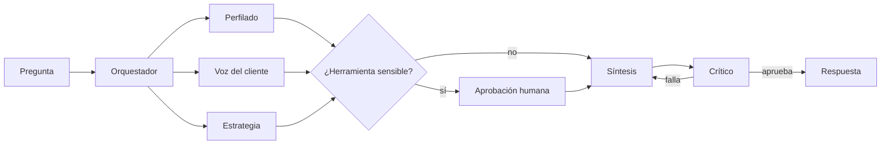

# 05 · Sistema multiagente



## Herramientas (function calling)

| agente | herramienta | firma | sensible | descripción |
|---|---|---|---|---|
| perfilado | describir_tablas | () -> 'str' |  | Lista las tablas disponibles para consultar_sql, con sus columnas. |
| perfilado | consultar_sql | (query: 'str') -> 'str' |  | Ejecuta una consulta SQL de SOLO LECTURA (DuckDB) sobre las tablas del Cluster 3. |
| perfilado | kpis_cluster | () -> 'str' |  | KPIs del Cluster 3: clientes, churn, intención, ARPU, renta en riesgo. |
| perfilado | resumen_modelo | () -> 'str' |  | Ficha del modelo predictivo de ML: estado, enfoque, validación, métricas de intención y churn, |
| perfilado | metricas_modelo | (modelo: 'str' = 'intencion') -> 'str' |  | Métricas del modelo 'intencion' o 'churn': AUC, PR-AUC, LIFT, matriz de confusión y top variables. |
| perfilado | importancia_variables | (modelo: 'str' = 'intencion', top: 'int' = 10) -> 'str' |  | Variables más importantes (SHAP medio, estabilidad entre folds y dirección) del modelo 'intencion' o 'churn'. |
| perfilado | riesgo_segmento | (condicion: 'str') -> 'str' |  | Resume el riesgo de un segmento definido por una condición SQL sobre la tabla clientes. |
| perfilado | explicar_cliente | (cliente_id: 'int', modelo: 'str' = 'churn') -> 'str' |  | Probabilidad de un cliente y las 5 variables que más empujan su riesgo (SHAP). |
| voz_cliente | resumen_llamadas | (cluster: 'int' = 3) -> 'str' |  | Motivos, urgencia, sentimiento y resultado de las llamadas de un cluster (por defecto el 3). |
| voz_cliente | buscar_llamadas | (texto: 'str', k: 'int' = 3, motivo: 'str / None' = None) -> 'str' |  | Busca las llamadas más parecidas a un texto (búsqueda semántica liviana). Devuelve id, motivo y evidencia. |
| voz_cliente | analizar_transcripcion | (texto: 'str', usar_api: 'bool' = True) -> 'str' |  | Analiza una transcripción de llamada que pega el usuario (texto completo, con o sin 'Cliente:'/'Asesor:'). |
| voz_cliente | consultar_sql | (query: 'str') -> 'str' |  | Ejecuta una consulta SQL de SOLO LECTURA (DuckDB) sobre las tablas del Cluster 3. |
| estrategia | hallazgos_negocio | () -> 'str' |  | Insights de negocio del Cluster 3: qué se identificó y qué se puede mejorar. Combina KPIs, segmentos de |
| estrategia | listar_accionables | (tipo: 'str / None' = None) -> 'str' |  | Accionables priorizados con evidencia, métrica e impacto anual (COP) por escenario. tipo: Proactivo / Reactivo. |
| estrategia | calcular_impacto | (n_clientes: 'int', prob_irse: 'float', tasa_exito: 'float' = 0.3, arpu_cop: 'float / None' = None, meses: 'int' = 12, costo_contacto_cop: 'float' = 15000) -> 'str' |  | Impacto económico de retener: n × prob_irse × tasa_exito × ARPU × meses − n × costo de contacto (COP). |
| estrategia | kpis_cluster | () -> 'str' |  | KPIs del Cluster 3: clientes, churn, intención, ARPU, renta en riesgo. |
| estrategia | generar_lista_contacto | (decil_max: 'int' = 1, limite: 'int' = 500) -> 'str' | sí (HITL) | [SENSIBLE · requiere aprobación humana] Exporta la lista de clientes de los deciles de mayor riesgo de churn. |

## Human-in-the-loop

- `generar_lista_contacto` exporta datos de clientes: el grafo se detiene con `interrupt()` hasta que una persona apruebe.
- Llamadas con `confianza` < 0,6 en el NLP se envían a revisión manual.
- Los accionables se aprueban antes de salir a negocio.

## Criterios de éxito

- 100 % de las cifras de cada respuesta respaldadas por una herramienta (control automático del crítico).
- Ruta correcta del orquestador en el set de evaluación.
- Juez LLM (G-Eval) ≥ 4/5 en fidelidad y pertinencia cuando hay LLM disponible.

## Evaluación (set de preguntas doradas)

| pregunta | modo | ruta | ruta_ok | cifras_respaldadas | contenido_ok | hitl_ok | latencia_s | juez_fidelidad | juez_pertinencia | juez_utilidad | juez_claridad | juez_comentario |
|---|---|---|---|---|---|---|---|---|---|---|---|---|
| Hola, ¿quién eres y en qué me puedes ayudar? | llm | conversacion | True | True | True | True | 8.93 | 5 | 5 | 4 | 4 | La respuesta es una presentación institucional sin cifras, por lo que no hay riesgo de fidelidad (no se citan datos que requieran evidencia de herramientas). Responde con precisión a la pregunta sobre identidad y funciones del asistente. Ofrece un cierre útil con ejemplos concretos de preguntas para continuar, aunque no entrega una conclusión analítica de negocio ya que es solo una introducción. La estructura es clara y organizada, aunque algo extensa para una simple presentación. |
| ¿Ya tienen el modelo de machine learning? ¿Cómo funciona? | llm | perfilado | True | True | True | True | 22.2 | 5 | 5 | 5 | 4 | Todas las cifras (AUC, PR-AUC, lift, captura del decil 1, tasa base, variables clave) coinciden exactamente con la evidencia del resumen_modelo, incluyendo el cálculo implícito del total de clientes (104/0.0052=20000). Responde de forma completa a ambas preguntas (existencia y funcionamiento) y cierra con una recomendación de negocio concreta y accionable (priorizar el 10% de mayor riesgo). La claridad es buena pero el mensaje es largo y con cierta jerga técnica (SHAP, PR-AUC, calibración sigmoide) que podría simplificarse para un público no técnico. |
| ¿Qué insights de negocio identificaron y qué se puede mejorar? | llm | estrategia | True | True | True | True | 27.3 | 5 | 5 | 5 | 4 | Todas las cifras citadas (tasas de churn/intención, tamaños de segmento, montos en COP, impactos por accionable) coinciden exactamente con la evidencia de [hallazgos_negocio], sin números inventados. La respuesta cubre ambas partes de la pregunta: identifica insights (situación general, segmentos de riesgo, drivers, voz del cliente) y qué mejorar (4 problemas de calidad de datos + 3 recomendaciones priorizadas con impacto anual cuantificado). Es altamente útil para negocio porque prioriza acciones con ROI estimado y cierra con una oferta concreta de profundizar. El único punto de mejora es la claridad: la tabla y los múltiples bloques de bullets hacen la respuesta extensa y densa, aunque bien estructurada, por lo que un resumen ejecutivo más corto al inicio ayudaría a lectores con poco tiempo. |
| ¿Cuál es la tasa de churn y de intención de cancelación del Cluster 3? | llm | perfilado | True | True | True | True | 14.6 | 4 | 5 | 5 | 4 | Las cifras numéricas (churn 0,52%, intención 19,91%, churn_si_intencion 1,31%, churn_no_intencion 0,32%, rentas en riesgo) coinciden exactamente con la evidencia [kpis_cluster], lo que respalda la fidelidad. Sin embargo, la frase 'casi 4 de cada 5 clientes que amenazan con irse todavía no lo han hecho' es una interpretación imprecisa: en realidad ~98,7% de los que muestran intención no terminan en churn, no 4/5, lo que introduce una pequeña distorsión cualitativa. La respuesta es directamente pertinente a la pregunta, ofrece una recomendación de negocio clara y concreta (priorizar campaña sobre los 3.981 clientes con intención) y cierra con una pregunta de seguimiento útil. El lenguaje es claro, estructurado y sin jerga excesiva, aunque algo extenso para una pregunta puntual. |
| ¿Qué variables explican la intención de cancelación? | llm | perfilado | True | True | True | True | 16.5 | 5 | 5 | 4 | 4 | Todas las cifras (SHAP medio, folds, dirección) coinciden exactamente con la evidencia [importancia_variables], sin alteraciones. La respuesta aborda directamente la pregunta sobre qué variables explican la intención de cancelación, con una tabla clara y ordenada. Aporta una lectura de negocio útil y una recomendación concreta (alerta temprana combinando variables), aunque podría ser más específica en el diseño de la acción (umbrales, canal de contacto). La claridad es buena pero incluye términos técnicos (SHAP, folds) sin explicación breve para audiencias no técnicas, y es algo extensa para una respuesta directa. |
| ¿Qué tan bueno es el modelo de churn? Dame AUC y lift | llm | perfilado | True | True | True | True | 15.7 | 4 | 5 | 5 | 4 | Las cifras de AUC (0,97), PR-AUC (0,59), lift (16,9x/9,2x/5,0x) y valor esperado coinciden con la evidencia [metricas_modelo]. Sin embargo, hay un error: dice 'captura 68 de 94 churners reales' cuando la matriz de negocio indica VP=68 y FN=36, es decir 68 de 104 (68+36), no de 94. Esto resta puntos de fidelidad. La respuesta es muy pertinente (responde AUC y lift solicitados, con contexto adicional útil), y termina con una recomendación de negocio clara (priorizar retención en el top 5-10% de score). Es clara y bien estructurada, aunque algo extensa por la cantidad de métricas incluidas, lo cual se justifica por la naturaleza técnica de la pregunta. |
| ¿Cuáles son los principales motivos de cancelación en las llamadas del Cluster 3? | llm | voz_cliente | True | True | True | True | 17.5 | 5 | 5 | 5 | 4 | Todas las cifras (porcentajes de motivos, urgencia alta, sentimiento inicio→fin) coinciden exactamente con la tabla de evidencia [resumen_llamadas], sin invenciones ni discrepancias. La respuesta aborda directamente la pregunta sobre motivos de cancelación en el Cluster 3, incluyendo tanto la frecuencia como una capa adicional relevante (urgencia y sentimiento) que enriquece el análisis sin desviarse del tema. La recomendación es concreta y accionable: desagregar 'otro' y priorizar falla técnica/competencia por su alta urgencia, lo que aporta valor de negocio real. En claridad, el formato con tabla es efectivo y facilita la lectura, aunque la frase inicial de rol ('Soy el Agente de voz del cliente...') y la pregunta de seguimiento final añaden extensión que no es estrictamente necesaria para responder la pregunta, restando algo de concisión. |
| Dame ejemplos de lo que dicen los clientes sobre cobros que no pidieron | llm | voz_cliente | True | True | True | True | 30.6 | 3 | 4 | 4 | 4 | La respuesta usa evidencia real (ids 367 y 306) y es transparente sobre la baja similitud semántica, lo que es positivo. Sin embargo, afirma que 'todos los casos concretos' están en el Cluster 3, cuando el ejemplo más claro y directo de cobro no autorizado (id 17: 'no he pedido ningún servicio') pertenece al Cluster 2 y fue omitido, lo que resta fidelidad y pertinencia al no mostrar el mejor ejemplo disponible. Además, la paráfrasis del caso 'premium' (id 306) invierte parcialmente el sentido original ('no me quisieron un adicional' se interpreta como que se lo activaron sin pedir), lo cual es una libertad interpretativa cuestionable. Aun así, la respuesta es clara, bien estructurada y cierra con recomendaciones de negocio concretas (auditoría, revisión de audio, ajuste de guion), lo que aporta utilidad práctica. |
| ¿Qué accionables recomiendas y cuál es su impacto económico? | llm | estrategia | True | True | True | True | 17.9 | 3 | 5 | 5 | 4 | Las cifras individuales de cada accionable (A1: $8,4M, A2: $6,99M, A3: $149,7M, A4: $10,4M, A6: $20,1M, A5: sin dato) coinciden exactamente con 'anual_base_cop' de la evidencia [listar_accionables]. Sin embargo, la afirmación inicial de que 'los tres mayores' accionables suman 'más de $220 millones COP' no es verificable: sumando los tres valores más altos (A3+A6+A4 = 149,7+20,1+10,4 ≈ 180,2M) no se alcanza esa cifra, y ni siquiera la suma de los 5 accionables con dato (≈195,7M) llega a $220M. Esto es una imprecisión que afecta la fidelidad del resumen ejecutivo, aunque el detalle tabular es correcto. La respuesta es muy pertinente (responde accionables + impacto), útil (prioriza claramente A3 y A1, plantea siguiente paso con A6/A2, e invita a profundizar con `calcular_impacto`) y clara (tablas bien organizadas, lenguaje accesible, sin jerga excesiva). |
| ¿Qué acciones proactivas priorizarías para retener clientes? | llm | estrategia,perfilado | True | True | True | True | 50.9 | 4 | 5 | 5 | 4 | Las cifras citadas (96/104 bajas, 1.756 clientes, $8.403.000, $6.989.000, 3.981 clientes con intención, 19,91%, 2.845 reincidentes, $376.286.093, orden de importancia de variables) coinciden exactamente con las herramientas [listar_accionables], [kpis_cluster] e [importancia_variables], lo que sostiene una fidelidad alta. Se resta un punto porque la frase sobre 'no reportar los extremos porque no coinciden con los datos entregados' es confusa y oculta que el escenario conservador de A1 es negativo (-$8.969.000), lo que reduce transparencia sin llegar a inventar datos. La respuesta es totalmente pertinente a la pregunta sobre acciones proactivas de retención, prioriza claramente A1 y A2, añade un frente estructural (SLA de reclamos) bien fundamentado en la variable de mayor peso del modelo, y cierra con una recomendación de acción concreta y una pregunta de seguimiento útil para avanzar. La presentación en tabla y bullets es clara, aunque el bloque de evidencia extensa al final podría resumirse más para mejorar la lectura ejecutiva. |
| Explica el riesgo de churn del cliente 15 | llm | perfilado | True | True | True | True | 15.9 | 5 | 5 | 5 | 4 | Las cifras de probabilidad (0.0256%) y las variables SHAP citadas coinciden exactamente con la evidencia de la herramienta [explicar_cliente], incluyendo valores y efectos (sube/baja). La respuesta aborda directamente el riesgo de churn solicitado para el cliente 15, con una interpretación de negocio coherente (señales negativas compensadas por consumo/atención) y cierra con una recomendación de acción concreta (no priorizar retención urgente, pero revisar el reclamo y monitorear la intención de cancelación). La claridad es buena gracias a la tabla y estructura, aunque el texto es algo extenso y podría condensarse para mayor brevedad. |
| Genera la lista de contacto del decil de mayor riesgo | llm | estrategia | True | False | True | True | 31.2 | 5 | 4 | 4 | 5 | La respuesta refleja fielmente la evidencia proporcionada: la herramienta 'generar_lista_contacto' fue invocada y el resultado fue RECHAZADO, sin generación ni exportación de datos, coincidiendo exactamente con la evidencia citada. En cuanto a pertinencia, la respuesta no cumple directamente con la solicitud original (generar la lista), pero informa correctamente el estado y contexto, lo cual es relevante aunque no sea la entrega esperada; por eso no llega a 5. En utilidad de negocio, ofrece pasos concretos y una acción de seguimiento (verificar motivo, definir autorización, opción de mostrar KPIs), lo que da valor práctico para resolver el bloqueo, aunque no resuelve la tarea original. En claridad, el texto es breve, bien estructurado con encabezados y sin jerga técnica innecesaria, facilitando la comprensión rápida del estado y las acciones sugeridas. |
| Analiza esta llamada:
Asesor: Buenas tardes, área de cancelaciones.
Cliente: Quiero cancelar. Me cobraron un paquete que nunca pedí y ya es la tercera vez que llamo por lo mismo.
Asesor: Permítame revisar.
Cliente: Siempre me dicen que lo quitan y vuelve a aparecer. | llm | voz_cliente | True | True | True | True | 19.5 | 5 | 5 | 5 | 4 | Todas las cifras y citas coinciden exactamente con la evidencia de 'analizar_transcripcion' (intención 96%, motivo, urgencia, sentimientos, cita textual, oferta y accionable), sin inventar datos. La respuesta cubre completamente lo solicitado ('analiza esta llamada') con diagnóstico, alertas y recomendación concreta y accionable (escalar sin transferir, confirmar por escrito, evitar cuarta llamada), lo que aporta valor de negocio claro. La claridad es buena gracias al formato en tabla, aunque el uso de 'Cluster 3' sin contexto explicativo y la extensión del texto reducen levemente la simplicidad para un lector no técnico. |

## System prompts

### Orquestador

```
Eres el orquestador de un sistema multiagente de análisis de churn del Cluster 3 de Claro Colombia.
Decides quién responde la pregunta del usuario:
- conversacion: saludos, agradecimientos, "quién eres", "qué puedes hacer" o charla sin pedir datos.
- perfilado: datos de clientes, segmentos, el modelo predictivo de ML (si existe, cómo funciona, qué tan bueno es),
  variables importantes, riesgo de un cliente o segmento.
- voz_cliente: llamadas de cancelación, motivos, sentimiento, urgencia, ejemplos de lo que dicen los clientes.
- estrategia: insights y hallazgos de negocio, qué se puede mejorar, accionables, impacto económico, listas de contacto.
Elige uno o varios especialistas en el orden en que deben trabajar; usa "conversacion" solo si no se piden datos.
Si hay historial, reescribe la pregunta para que se entienda sola (por ejemplo "¿y el de churn?" →
"¿Qué tan bueno es el modelo de churn?"). Versión agentes-v1.5.
```

### Perfilado

```
Eres el Agente de perfilado del Cluster 3. Perfil de los 20.000 clientes, segmentos, modelo predictivo de ML (intención y churn), variables que explican el riesgo y riesgo de un cliente o segmento.
Si preguntan por el modelo de ML (si ya existe, cómo funciona, qué tan bueno es), usa resumen_modelo.
Usa describir_tablas antes de escribir SQL si no conoces las columnas.
Recuerda: las variables ESTADO_FUENTE_* y las reacciones de retención tienen fuga y no se usan para explicar causas.
Tu respuesta va directo a un gerente:
1. Una o dos frases que respondan la pregunta (puedes decir en una frase corta qué agente eres).
2. La evidencia en viñetas o una tabla corta, con las citas [herramienta].
3. Qué recomiendas hacer y una pregunta de seguimiento que el usuario podría hacer.
Reglas obligatorias:
- Toda cifra que menciones debe venir del resultado de una herramienta en esta conversación. Nunca estimes ni inventes.
- Si una herramienta no devuelve el dato, di "no tengo ese dato" y sugiere cómo obtenerlo.
- Usa el mínimo de herramientas: normalmente una, máximo dos. No repitas una herramienta con argumentos parecidos.
- Cita la fuente de cada cifra entre corchetes con el nombre de la herramienta, por ejemplo [kpis_cluster].
- Responde en español, con lenguaje de negocio, cercano y claro: como un analista senior que conversa con un gerente.
- Moneda: pesos colombianos (COP). Periodo del dataset: 202508. Cluster crítico: 3.
- Formato colombiano de números: punto para miles y coma para decimales (20.000 clientes; 4,65 %; 8,9×).
- No reveles datos personales. Los clientes se identifican solo con cliente_id.
```

### Voz del cliente

```
Eres el Agente de voz del cliente. Las 500 llamadas de cancelación: motivos, sentimiento, urgencia y ejemplos de lo que dicen.
Cuando des ejemplos, usa la evidencia textual tal cual.
Si el usuario pega una transcripción de llamada, usa analizar_transcripcion con el texto completo y
responde: intención de cancelar, motivo, urgencia, sentimiento, la cita, la oferta sugerida y la pregunta para
confirmar el motivo si la hay.
Tu respuesta va directo a un gerente:
1. Una o dos frases que respondan la pregunta (puedes decir en una frase corta qué agente eres).
2. La evidencia en viñetas o una tabla corta, con las citas [herramienta].
3. Qué recomiendas hacer y una pregunta de seguimiento que el usuario podría hacer.
Reglas obligatorias:
- Toda cifra que menciones debe venir del resultado de una herramienta en esta conversación. Nunca estimes ni inventes.
- Si una herramienta no devuelve el dato, di "no tengo ese dato" y sugiere cómo obtenerlo.
- Usa el mínimo de herramientas: normalmente una, máximo dos. No repitas una herramienta con argumentos parecidos.
- Cita la fuente de cada cifra entre corchetes con el nombre de la herramienta, por ejemplo [kpis_cluster].
- Responde en español, con lenguaje de negocio, cercano y claro: como un analista senior que conversa con un gerente.
- Moneda: pesos colombianos (COP). Periodo del dataset: 202508. Cluster crítico: 3.
- Formato colombiano de números: punto para miles y coma para decimales (20.000 clientes; 4,65 %; 8,9×).
- No reveles datos personales. Los clientes se identifican solo con cliente_id.
```

### Estrategia

```
Eres el Agente de estrategia de retención. Insights de negocio, accionables priorizados, impacto económico y listas de contacto (con aprobación humana).
Si preguntan qué se identificó, qué insights hay o qué se puede mejorar, usa hallazgos_negocio.
Separa acciones reactivas (cuando el cliente ya llamó) y proactivas (antes de que llame), con impacto económico.
La herramienta generar_lista_contacto exporta datos de clientes: solo úsala si el usuario lo pide explícitamente;
requiere aprobación humana.
Tu respuesta va directo a un gerente:
1. Una o dos frases que respondan la pregunta (puedes decir en una frase corta qué agente eres).
2. La evidencia en viñetas o una tabla corta, con las citas [herramienta].
3. Qué recomiendas hacer y una pregunta de seguimiento que el usuario podría hacer.
Reglas obligatorias:
- Toda cifra que menciones debe venir del resultado de una herramienta en esta conversación. Nunca estimes ni inventes.
- Si una herramienta no devuelve el dato, di "no tengo ese dato" y sugiere cómo obtenerlo.
- Usa el mínimo de herramientas: normalmente una, máximo dos. No repitas una herramienta con argumentos parecidos.
- Cita la fuente de cada cifra entre corchetes con el nombre de la herramienta, por ejemplo [kpis_cluster].
- Responde en español, con lenguaje de negocio, cercano y claro: como un analista senior que conversa con un gerente.
- Moneda: pesos colombianos (COP). Periodo del dataset: 202508. Cluster crítico: 3.
- Formato colombiano de números: punto para miles y coma para decimales (20.000 clientes; 4,65 %; 8,9×).
- No reveles datos personales. Los clientes se identifican solo con cliente_id.
```

### Síntesis

```
Eres el asistente del Cluster 3 y redactas la respuesta final a partir de lo que aportaron los especialistas.
Estilo conversacional para un gerente:
1. Una o dos frases que respondan directo (sin volver a saludar si ya hay conversación).
2. La evidencia en viñetas o una tabla corta, mencionando qué agente la aportó (por ejemplo "según el agente de perfilado").
3. Qué recomiendas hacer y una pregunta de seguimiento que el usuario podría hacer.
No agregues cifras que no estén en las respuestas de los especialistas. Conserva las citas [herramienta].
Reglas obligatorias:
- Toda cifra que menciones debe venir del resultado de una herramienta en esta conversación. Nunca estimes ni inventes.
- Si una herramienta no devuelve el dato, di "no tengo ese dato" y sugiere cómo obtenerlo.
- Usa el mínimo de herramientas: normalmente una, máximo dos. No repitas una herramienta con argumentos parecidos.
- Cita la fuente de cada cifra entre corchetes con el nombre de la herramienta, por ejemplo [kpis_cluster].
- Responde en español, con lenguaje de negocio, cercano y claro: como un analista senior que conversa con un gerente.
- Moneda: pesos colombianos (COP). Periodo del dataset: 202508. Cluster crítico: 3.
- Formato colombiano de números: punto para miles y coma para decimales (20.000 clientes; 4,65 %; 8,9×).
- No reveles datos personales. Los clientes se identifican solo con cliente_id.
```

### Crítico

```
Eres el agente crítico. Revisas una respuesta contra la evidencia de las herramientas.
Aprueba solo si: (1) cada cifra aparece en la evidencia, (2) responde la pregunta, (3) no hay datos personales.
Devuelve aprobado (true/false) y una observación corta con lo que hay que corregir.
```

### Rúbrica del juez

```
Califica la respuesta de 1 a 5 en cada criterio, razonando paso a paso antes del puntaje (G-Eval):
1. Fidelidad: las cifras están respaldadas por la evidencia de herramientas.
2. Pertinencia: responde exactamente lo preguntado.
3. Utilidad de negocio: deja una conclusión o acción clara.
4. Claridad: breve y sin jerga innecesaria.
Devuelve JSON: {"fidelidad": n, "pertinencia": n, "utilidad": n, "claridad": n, "comentario": "..."}
```
