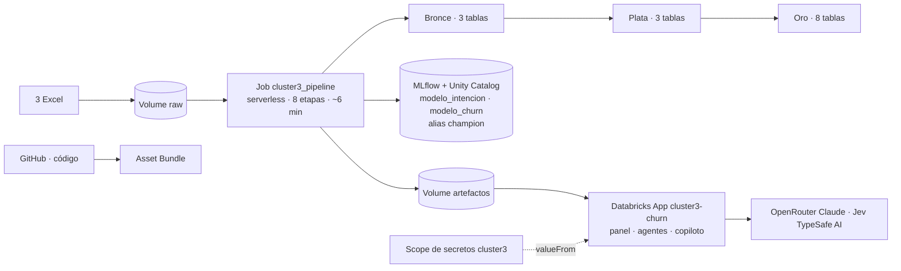
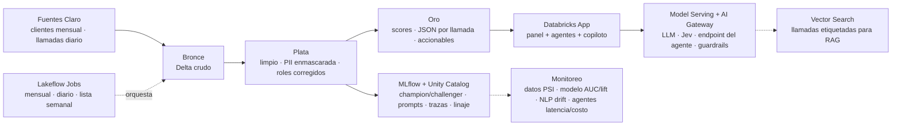

# 06 · Arquitectura en Databricks, MLOps y LLMOps

El mismo paquete `cluster3` corre en local, en Databricks y en AWS. Lo que cambia es dónde viven los datos y quién
ejecuta el pipeline. Databricks es la plataforma objetivo; AWS es un respaldo independiente para la demo.

## Lo desplegado hoy (Databricks Free Edition)

Toda la infraestructura está declarada en `databricks.yml` (Asset Bundle): se crea con `databricks bundle deploy` y
se elimina con `databricks bundle destroy`. Guía paso a paso: `deploy/databricks/README.md`.

| Pieza | Recurso | Detalle |
|---|---|---|
| Datos crudos | Volume `workspace.cluster3.raw` | Los 3 Excel y, en `insumos/`, la clasificación híbrida ya calculada (evita volver a pagar el LLM) |
| Pipeline | Job `cluster3_pipeline` | Notebook `notebooks/databricks/pipeline_job.py`, cómputo serverless, a demanda; parámetros `usar_llm` y `usar_jev` |
| Bronce | `bronce_clientes`, `bronce_llamadas`, `bronce_diccionario` | Tal como llegó, todo como texto, con `_fuente` e `_ingesta_utc` |
| Plata | `plata_clientes`, `plata_llamadas`, `plata_registro_decisiones` | Clientes corregidos, llamadas anonimizadas con roles corregidos, decisión por variable |
| Oro | `oro_scores`, `oro_llamadas_analisis`, `oro_segmentos_cluster3`, `oro_accionables`, `oro_lift_intencion`, `oro_lift_churn`, `oro_nlp_benchmark`, `oro_agent_evals` | Lo que consumen la app, los agentes y negocio |
| Modelos | `workspace.cluster3.modelo_intencion`, `workspace.cluster3.modelo_churn` | Registrados en Unity Catalog con alias `champion`, formato skops, con AUC, PR-AUC y lift en MLflow |
| Artefactos | Volume `workspace.cluster3.artefactos` | Salidas del job que descarga la app al arrancar |
| App | Databricks Apps `cluster3-churn` | Streamlit con su propio service principal; permiso mínimo: leer 2 secretos y el Volume de artefactos |
| Secretos | Scope `cluster3` | `OPENROUTER_API_KEY` y `TYPESAFE_API_KEY`; la app los recibe por `valueFrom`, nunca en el código |

Límite de Free Edition: la app corre como máximo 24 horas desde que se arranca y se apaga si se agota la cuota diaria
de cómputo. Antes de una demo: `databricks apps start cluster3-churn` 1–2 horas antes y abrirla una vez.

## Respaldo en AWS

| Pieza | Detalle |
|---|---|
| Cómputo | EC2 t3.medium, Amazon Linux 2023, IP elástica |
| Contenedores | Docker Compose: app (`Dockerfile`) + Caddy (HTTPS automático con Let's Encrypt y usuario/clave) |
| DNS | Subdominio en Cloudflare |
| Acceso | Session Manager (SSM); el puerto 22 está cerrado y el firewall solo abre 80 y 443 |
| Artefactos | Traslado por bucket S3 temporal con enlace de 15 minutos, borrado al terminar; `data/raw` nunca sale del equipo |
| Claves | En el `.env` de la instancia, cargado por el administrador |

Guía: `deploy/aws/README.md`.

## Arquitectura de producción (propuesta)

| Paso | Hoy (prueba) | Producción |
|---|---|---|
| Ingesta | Excel subido al Volume | Tablas del data lake de Claro, carga mensual |
| Pipeline | Job `cluster3_pipeline` a demanda | Lakeflow Jobs mensual (dataset) + diario (llamadas) |
| Scoring | Batch sobre el mes | Batch semanal; lista del decil 1 cada lunes |
| NLP | Híbrido Jev + LLM sobre las 500 llamadas (reanudable) | Híbrido sobre las llamadas nuevas del día |
| RAG | TF-IDF sobre 50 llamadas etiquetadas | Vector Search sobre una muestra etiquetada creciente |
| LLM | OpenRouter (Claude Sonnet 5 y Haiku 4.5) con claves en secretos | Model Serving + AI Gateway (límites, registro, guardarraíles) |

## MLOps

| Práctica | Implementación |
|---|---|
| Reproducibilidad | Paquete versionado, `uv.lock`, semilla fija, pipeline de una sola orden |
| Seguimiento | MLflow: parámetros, AUC, PR-AUC, LIFT, Brier, supuestos del umbral |
| Registro | Unity Catalog: `modelo_intencion`, `modelo_churn` con alias `champion` |
| Validación | CV estratificada 3×5, IC del AUC por bootstrap, comparación con y sin fuga |
| Promoción | Un challenger reemplaza a champion solo si mejora AUC y LIFT@10 sin empeorar la calibración |
| Monitoreo de datos | PSI por variable del top SHAP (alerta > 0,2) y tasa de nulos |
| Monitoreo de modelo | AUC y LIFT@10 mensual contra el churn real; calibración por decil |
| Monitoreo de negocio | Churn del decil contactado vs grupo de control; renta retenida |

## LLMOps

| Práctica | Implementación |
|---|---|
| Prompts versionados | `PROMPT_VERSION` en `nlp/llm_classifier.py` (`clasificador-llamadas-v1.0`), `agents/prompts.py` (`agentes-v1.5`) y `nlp/analizador.py` (`copiloto-v1.2`) |
| Salida estructurada | Esquema Pydantic `CallAnalysis`; validación y un reintento |
| Anclaje | La evidencia debe ser cita literal de la transcripción; si no, se reintenta y baja la confianza |
| Recuperación | RAG few-shot: las 3 llamadas etiquetadas más parecidas (TF-IDF), nunca la misma llamada |
| Evaluación NLP | Reglas vs LLM vs Jev vs híbrido contra 50 llamadas etiquetadas a mano: exactitud, F1 macro, kappa y correlación de sentimiento (`nlp_benchmark.csv`) |
| Evaluación agentes | 13 preguntas doradas: ruta, cifras respaldadas, contenido, aprobación humana y juez LLM (G-Eval) |
| Guardarraíles | SQL de solo lectura, límite de filas, herramienta sensible con aprobación humana, crítico de cifras, plantilla fija si el cliente insiste en cancelar |
| Trazabilidad | Traza por nodo (agentes, herramientas, latencia) visible en la app |
| Costo y latencia | Jev para clasificar; Haiku para enrutar y revisar; especialistas en paralelo; caché; streaming; modo offline sin LLM. Detalle en `docs/09_costos_ia.md` |
| Privacidad | Segunda pasada de PII antes de enviar texto a cualquier LLM; datos eliminados al cierre |

## Seguridad y datos

- Los datos son internos de Claro, sin datos personales, con uso autorizado por la gerencia.
- `data/raw`, los datos procesados, los modelos y las listas de contacto nunca se versionan en git.
- En Databricks los permisos se dan por Unity Catalog y por los recursos de la app (permiso mínimo).
- En AWS la app queda detrás de Caddy con HTTPS y usuario/clave; acceso a la instancia solo por SSM.
- Al cierre: `databricks bundle destroy -t dev`, `databricks secrets delete-scope cluster3`, terminar la instancia
  EC2, liberar la IP elástica, borrar el registro DNS y los datos locales.
