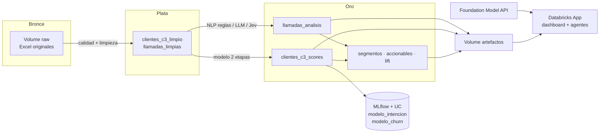

# 06 · Arquitectura en Databricks, MLOps y LLMOps

El mismo paquete `cluster3` corre en local, en Databricks y en AWS. Lo que cambia es dónde viven los datos
y quién ejecuta el pipeline.

## Capas

| Capa | Contenido | Dónde vive |
|---|---|---|
| Bronce | Excel de clientes, llamadas y diccionario tal como llegaron | Volume `workspace.cluster3.raw` |
| Plata | Datos limpios, con decisiones por variable y PII enmascarada en llamadas | Delta / Parquet |
| Oro | Scores por cliente, análisis por llamada, segmentos, accionables | Delta `workspace.cluster3.*` |
| Modelos | Intención y churn calibrados, con métricas y SHAP | MLflow + Unity Catalog |
| Consumo | App (dashboard y chat), listas de contacto aprobadas | Databricks Apps / EC2 |

## Orquestación

| Paso | Hoy (prueba) | Producción |
|---|---|---|
| Ingesta | Excel subido a mano al Volume | Tablas del data lake de Claro, carga mensual |
| Pipeline | Job `cluster3_pipeline` a demanda | Lakeflow Jobs mensual (dataset) + diario (llamadas) |
| Scoring | Batch sobre el mes | Batch semanal; lista del decil 1 cada lunes |
| NLP | Reglas; LLM y Jev sobre la muestra etiquetada | LLM/Jev sobre todas las llamadas nuevas del día |
| Agentes | App con modo llm u offline | App + endpoint del agente registrado en MLflow |

## MLOps

| Práctica | Implementación |
|---|---|
| Reproducibilidad | Paquete versionado, `uv.lock`, semilla fija, pipeline de una sola orden |
| Seguimiento | MLflow: parámetros, AUC, PR-AUC, LIFT, Brier, figuras de SHAP y ganancia |
| Registro | Unity Catalog: `modelo_intencion`, `modelo_churn` con alias `champion` / `challenger` |
| Validación | CV estratificada 3×5, IC del AUC por bootstrap, comparación con y sin fuga |
| Promoción | Challenger reemplaza a champion solo si mejora AUC y LIFT@10 sin empeorar calibración |
| Monitoreo de datos | PSI por variable del top SHAP (alerta > 0,2) y tasa de nulos |
| Monitoreo de modelo | AUC y LIFT@10 mensual contra el churn real; calibración por decil |
| Monitoreo de negocio | Churn del decil contactado vs grupo de control; renta retenida |

## LLMOps

| Práctica | Implementación |
|---|---|
| Prompts versionados | `PROMPT_VERSION` en `nlp/llm_classifier.py` y `agents/prompts.py`, guardado con cada resultado |
| Salida estructurada | Esquema Pydantic `CallAnalysis`; validación y un reintento |
| Anclaje | La evidencia debe ser cita literal de la transcripción; si no, se marca y se reintenta |
| Recuperación | Pocos ejemplos etiquetados a mano elegidos por similitud (RAG few-shot) |
| Evaluación NLP | Reglas vs LLM vs Jev contra 50 llamadas etiquetadas: F1 macro, kappa, exactitud de urgencia |
| Evaluación agentes | 9 preguntas doradas: ruta, cifras respaldadas, contenido, aprobación humana, juez LLM (G-Eval) |
| Guardarraíles | SQL de solo lectura, límite de filas, herramienta sensible con aprobación humana, crítico de cifras |
| Trazabilidad | Traza por nodo (agentes, herramientas, latencia) visible en la app |
| Costo | Modo offline sin LLM; LLM solo donde agrega valor (clasificación y síntesis) |
| Privacidad | Segunda pasada de PII antes de enviar texto a cualquier LLM; datos eliminados al cierre |

## Seguridad y datos

- Los datos son internos de Claro, sin datos personales, con uso autorizado por la gerencia.
- `data/raw` y los datos procesados nunca se versionan en git.
- En Databricks, los permisos se dan por Unity Catalog (lectura del Volume `artefactos` para la app).
- En AWS, la app queda detrás de Caddy con HTTPS y usuario/clave; acceso a la instancia solo por SSM.
- Al cierre: `databricks bundle destroy`, terminar la instancia EC2 y borrar los datos locales.
